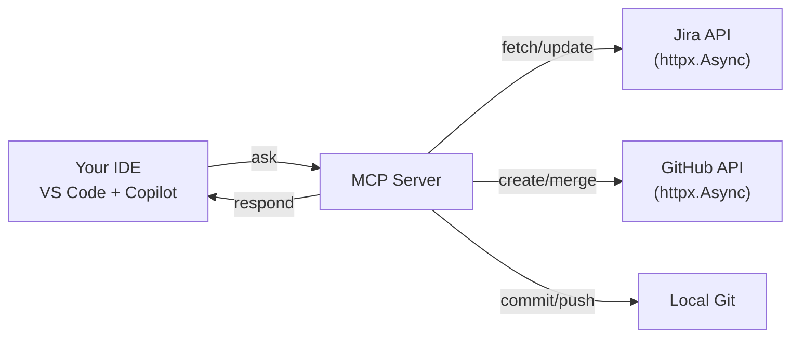

# Jira - GitHub MCP Server

A modular and extensible Model Context Protocol (MCP) server for Jira and
GitHub integration, enabling end-to-end automation of developer workflows -
from issue tracking to code changes and pull request management -  via AI
agents inside the IDE.


## Overview

- **Jira integration**: fetch issues by filters, search via JQL, and transition issues across workflows
- **GitHub integration**: create branches, open and merge PRs
- **Local Git operations**: stage, commit, and push changes locally
- **IDE-native**: works with any MCP-compatible agent (e.g., GitHub Copilot) over stdio
- **End-to-end workflow**: Jira issue → branch → code → commit → PR → merge → Jira status update

## Why

Developers constantly context-switch between Jira, GitHub, and their IDE,
breaking focus and slowing down delivery. This project transforms that workflow
into a seamless, IDE-native, conversational experience, allowing developers to
move from Jira issue to merged pull request using natural language and
AI-assisted automation.

## Features

- **Retrieve, filter, and search** Jira issues using **fields and JQL**
- **Transition** Jira issues across **workflow statuses**
- **Automate branch creation** as part of the **Jira-driven workflow**
- **Commit and push** changes from the **local Git repository**
- **Create and merge** GitHub **pull requests**
- **MCP resources** providing **workflow guidance** and **current issue context**


## Available Tools

| Tool | Description |
|------|-------------|
| `jira_get_issue` | Retrieve a Jira issue by key (e.g., KAN-1) with configurable fields |
| `jira_search_issues` | Search Jira using JQL; paginate and filter results |
| `jira_get_my_issues` | List issues assigned to the current user, optionally filtered by status/type... |
| `jira_transition_issue` | Move an issue to another status with optional comment |
| `create_branch_for_issue` | Create a new Git branch (e.g., `feature/KAN-15`) based on a Jira issue |
| `create_pull_request` | Create a PR on GitHub from a branch |
| `git_commit_and_push` | Stage all changes, commit with a message, and push to a branch |
| `merge_pull_request` | Merge a PR using squash, merge, or rebase; optionally check CI status |

## Project Structure

- `src/` — Application source code
  - `server/` — MCP server entry point and tool registration
  - `config/` — Configuration loading for Jira and GitHub
  - `providers/` — Jira/GitHub API clients and local Git operations
  - `tools/` — MCP tool definitions and implementations
  - `resources/` — MCP resources (workflow guidance, issue context)
  - `prompts/` — AI-facing prompts used internally by the server to guide agent behavior
- `tests/` — Integration and unit tests
- `pyproject.toml` — Project metadata and dependencies
- `uv.lock` — Dependency lockfile

## Architecture Overview

High-level overview of the system design and main components.

See full architecture documentation: [docs/architecture.md](docs/architecture.md)


## Installation & Setup

### Requirements
- Python 3.10+
- Git (available on PATH)
- Jira instance (Cloud or self-hosted) with REST API v3 access
- GitHub repository with token-based API access


### 1. Clone the Repository

```bash
git clone https://github.com/YOUR-USERNAME/jira-github-mcp.git
cd jira-github-mcp
```

### 2. Create & Activate a Virtual Environment

Using `uv` (recommended)
```bash
uv venv
```

Or with `python`
```bash
python -m venv .venv
```

### 3. Install Dependencies

Using `uv` (recommended):
```bash
uv sync
```

Or with pip:
```bash
pip install -r requirements.txt
```

The project depends on:
- `fastmcp`: MCP protocol and server utilities


### 4. Configure Environment Variables

Create a `.env` file in the repository root:
```env
# Jira Configuration
JIRA_BASE_URL=https://your-instance.atlassian.net
JIRA_EMAIL=your-email@example.com
JIRA_API_TOKEN=your-jira-api-token

# GitHub Configuration
GITHUB_TOKEN=your-github-personal-access-token
GIT_REPO_URL=https://github.com/owner/repo.git
GIT_DEFAULT_BRANCH=main

# Optional: Local Git Repository Path
# If omitted, defaults to the current working directory
GIT_REPO_LOCAL_PATH=/path/to/local/repo
```

**Notes:**
- `JIRA_BASE_URL` should not end with `/`
- Grant the GitHub PAT only the minimal permissions required (branches, pull requests, etc.)

### 5. Run the MCP Server

Run the server as a Python module:
```bash
python -m src.server.server
```

If you defined an entrypoint, you can also run:
```bash
mcp-server
```

### 6. Connect from an MCP Client

To use this server with an MCP client (e.g., VS Code / **GitHub Copilot**), configure the client to run the server from the project root.

**Example MCP configuration:**
```json
{
  "servers": {
    "jira-github-mcp-server": {
      "type": "stdio",
      "command": "python",
      "args": ["-m", "src.server.server"],
      "cwd": "/absolute/path/to/jira-github-mcp"
    }
  }
}
```

> **Note:** Replace `/absolute/path/to/mcp-server` with the actual path to the repository.

### Connecting to GitHub Copilot

Here's how to connect and start using the server with Copilot:

1. Open VS Code and ensure **GitHub Copilot** is installed
2. Sign in with your GitHub account (if not already signed in)
3. Add the MCP server configuration to your VS Code settings (see JSON above)
4. Reload VS Code
5. Start asking Copilot natural language questions—it will invoke the tools automatically

## How It Works



## Example Workflow

This example demonstrates a complete issue-to-merge flow using GitHub Copilot with this MCP server.

1. **Discover the next task**

   Ask Copilot:  
   > "What is the most urgent task assigned to me?"

   **Call Tools:**
   - `jira_get_my_issues` — list issues assigned to the user
   - `jira_search_issues` — prioritize by status or urgency

   _Selected issue: `KAN-42`_

2. **Start working on the issue**

   Ask Copilot:  
   > "Start work on KAN-42"

   **Call Tools:**
   - `jira_get_issue(issue_key="KAN-42")`
   - `create_branch_for_issue(issue_key="KAN-42")`
   - `jira_transition_issue(issue_key="KAN-42", to_status="In Progress")`

   Make changes in your editor.

3. **Commit changes**

   Ask Copilot:  
   > "Commit my changes with message 'Implement KAN-42'"

   **Call Tools:**
   - `git_commit_and_push(message="Implement KAN-42", branch="feature/KAN-42")`

4. **Create a pull request**

   Ask Copilot:  
   > "Create a PR for KAN-42"

   **Call Tools:**
   - `create_pull_request(issue_key="KAN-42", branch_name="feature/KAN-42")`
   - `jira_transition_issue(issue_key="KAN-42", to_status="In Review")`

   Code review and CI checks run on GitHub.

5. **Merge and close the issue**

   Ask Copilot:  
   > "Merge the PR and move KAN-42 to Done"

   **Call Tools:**
   - `merge_pull_request(pr_number=123)`
   - `jira_transition_issue(issue_key="KAN-42", to_status="Done")`

   Issue closed, code merged, workflow complete.


## Use Cases

- Day-to-day development workflows across Jira issues, branches, and pull requests
- Code review processes with clear pull request status tracking
- Sprint execution and task progress visibility
- Rapid bug fixes and hotfix workflows
- End-to-end feature development from issue to merge
- Team collaboration with consistent status and ownership tracking


## Future Enhancements

- **Multi-platform support**: Extend integrations beyond GitHub to additional platforms (e.g. GitLab)
- **Smarter workflows**: Multi-repo support, reusable JQL templates, and configurable automation rules
- **Deeper automation**: AI-assisted PR/commit drafting, webhook-driven synchronization, and CI/CD feedback


## Summary

This MCP server provides a clear and traceable development workflow by connecting Jira and GitHub through a single conversational interface.

By reducing manual coordination and keeping issues, branches, and pull requests in sync, it helps teams focus on development rather than process.

*Designed with a focus on clarity, extensibility, and developer experience.*

