# Architecture
This document describes the high-level architecture of the MCP GitHub & Jira integration.

## System Diagram


## Component Flow

### 1. Tool Registration Layer
Each tool is registered with the MCP server via the `@mcp.tool()` decorator.


### 2. Tool Layer (src/tools/)
Tools orchestrate the workflow:
- Accept user parameters
- Validate inputs
- Call provider APIs
- Format and return results

Example: `github_create_branch`

```mermaid
graph LR
    A["📥 Input:<br/>issue_key<br/>branch_name?"] -->|fetch| B["⚙️ Get Config:<br/>owner/repo"]
    B -->|api call| C["🔍 Fetch SHA:<br/>github_api_get"]
    C -->|create| D["✨ Create Branch:<br/>github_api_post"]
    D -->|return| E["📤 Output:<br/>branch ref + SHA"]
    
    style A fill:#e1f5ff
    style B fill:#f3e5f5
    style C fill:#fff3e0
    style D fill:#f1f8e9
    style E fill:#ede7f6
```


### 3. Provider Layer (src/providers/)
Low-level API clients for GitHub & Jira:

**GitHub Provider:**
- `github_api_get()` - GET requests with auth headers
- `github_api_post()` - POST requests with JSON body
- `github_api_put()` - PUT requests for merges
- Uses `httpx.AsyncClient` for async HTTP

**Jira Provider:**
- `jira_api_get()` - GET requests with Basic Auth
- `jira_api_post()` - POST requests (search, transitions)
- Uses `httpx.AsyncClient` for async HTTP

### 4. Config Layer (src/config/)
Load and validate environment variables:
- `github_config.py` - GITHUB_REPO_URL, GITHUB_TOKEN, GITHUB_DEFAULT_BRANCH
- `jira_config.py` - JIRA_BASE_URL, JIRA_EMAIL, JIRA_API_TOKEN
- Provide helper functions like `extract_repo_info()`

## Async Flow

All providers use async I/O with `httpx.AsyncClient`:


Benefits:
- Multiple concurrent requests don't block
- Better resource utilization
- Faster response times for parallel operations

## Testing Strategy

Tests use mocking to avoid real API calls:

```mermaid
graph LR
    A["🧪 Test<br/>asyncio.run()"] -->|setup| B["🎭 Tool Code<br/>Mocked Providers"]
    B -->|return| C["📋 Mock Responses<br/>AsyncMock"]
    C -->|verify| D["✓ Assertions<br/>API Calls"]
    D -->|result| E["⚡ Fast & Repeatable<br/>No Network"]
    
    style A fill:#fff9c4
    style B fill:#f0f4c3
    style C fill:#dcedc8
    style D fill:#c8e6c9
    style E fill:#a5d6a7
```



Key mocking pattern:
```python
with patch('src.tools.jira_tools.jira_get_issue.jira_api_get', 
           new=AsyncMock(return_value={"key": "KAN-1"})):
    result = asyncio.run(tool("KAN-1"))
    # Assert mock was called with correct params
```

## Error Handling

Tools validate and provide clear error messages:

- **Config errors** → ValueError (missing env vars)
- **API errors** → ValueError (404, 422, etc.)
- **Merge conflicts** → ValueError (PR not mergeable)
- **Validation errors** → ValueError (invalid transitions, missing reviews)
